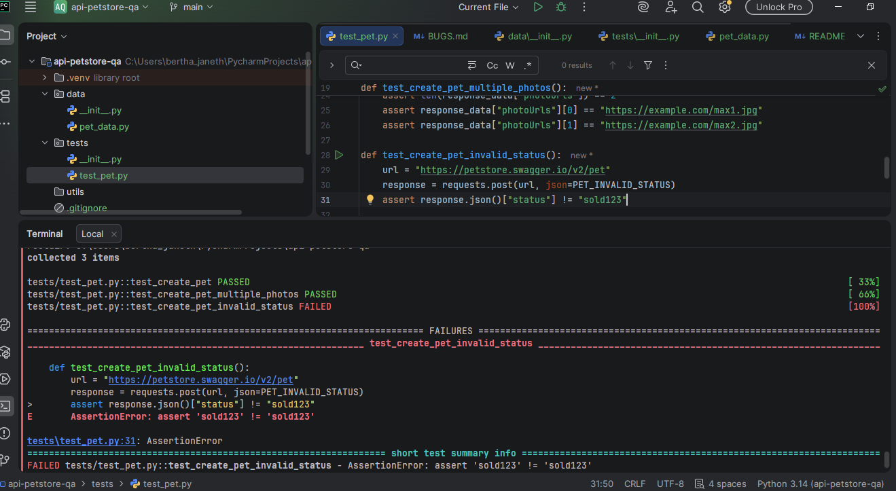
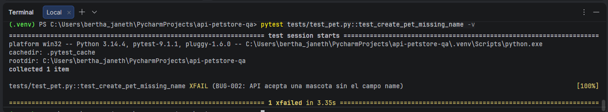
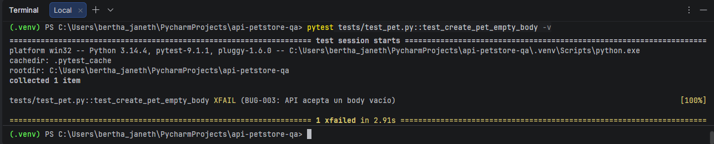
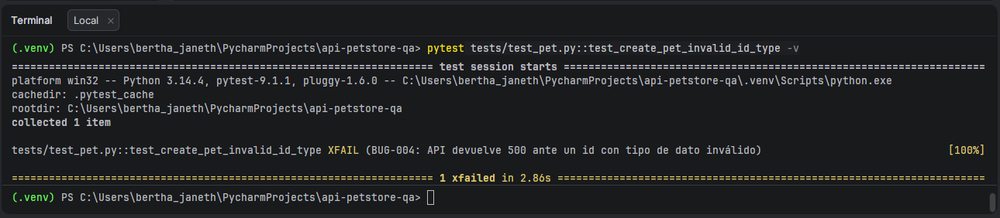
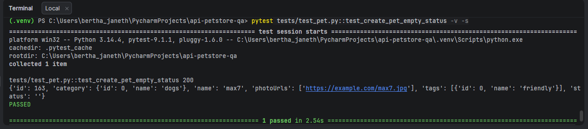

# Bugs encontrados

## BUG-001 — API acepta un valor no válido en el campo `status`

- **Severidad:** Media
- **Prioridad:** Media
- **Endpoint:** `POST /v2/pet`
- **Caso de prueba:** TC-003

### Descripción

La API permite crear una mascota utilizando un valor no válido en el campo `status`.

### Pasos para reproducir

1. Enviar una petición `POST` al endpoint `/v2/pet`.
2. Utilizar `status: "sold123"`.
3. Ejecutar la petición.
4. Revisar la respuesta de la API.

### Resultado esperado

La API debería rechazar el valor `"sold123"` por no corresponder a un estado válido.

### Resultado actual

La API responde con HTTP `200 OK` y devuelve:

```json
{
    "status": "sold123"
}
```
### Evidencia 




## BUG-002 — API acepta una mascota sin el campo `name`


- **Severidad:** Media
- **Prioridad:** Media
- **Endpoint:** `POST /v2/pet`
- **Caso de prueba:** TC-004

### Descripción

La API permite crear una mascota sin enviar el campo requerido `name`.

### Pasos para reproducir

1. Enviar una petición `POST` al endpoint `/v2/pet`.
2. Omitir el campo `name` del cuerpo de la petición.
3. Ejecutar la petición.
4. Revisar la respuesta de la API.

### Resultado esperado

La API debería rechazar la petición cuando no se proporciona el campo `name`.

### Resultado actual

La API responde con HTTP `200 OK` y crea la mascota sin el campo `name`.

### Evidencia de automatización

```text
XFAIL (BUG-002: API acepta una mascota sin el campo name)
```
### Evidencia: 



## BUG-003 — API acepta un body vacío

- **Severidad:** Alta
- **Prioridad:** Alta
- **Endpoint:** `POST /v2/pet`
- **Caso de prueba:** TC-005

### Descripción

La API permite enviar una petición `POST` con un body vacío y responde exitosamente, aunque no se proporciona información de la mascota.

### Pasos para reproducir

1. Enviar una petición `POST` al endpoint `/v2/pet`.
2. Utilizar un body vacío `{}`.
3. Ejecutar la petición.
4. Revisar la respuesta de la API.

### Resultado esperado

La API debería rechazar la petición porque no contiene los datos necesarios para crear una mascota.

### Resultado actual

La API responde con HTTP `200 OK` y devuelve una mascota con un `id` y listas vacías:

```json
{
    "id": 9223372036854775807,
    "photoUrls": [],
    "tags": []
}
```

### Evidencia



## BUG-004 — API devuelve error 500 ante un `id` con tipo de dato inválido

- **Severidad:** Alta
- **Prioridad:** Alta
- **Endpoint:** `POST /v2/pet`
- **Caso de prueba:** TC-007

### Descripción

La API devuelve un error interno del servidor cuando recibe un valor de tipo incorrecto en el campo `id`.

### Pasos para reproducir

1. Enviar una petición `POST` al endpoint `/v2/pet`.
2. Enviar el campo `id` como texto, por ejemplo `"abc"`.
3. Ejecutar la petición.
4. Revisar la respuesta de la API.

### Resultado esperado

La API debería rechazar el valor con una respuesta de validación apropiada, sin generar un error interno del servidor.

### Resultado actual

La API responde con HTTP `500 Internal Server Error`:

```json
{
    "code": 500,
    "type": "unknown",
    "message": "something bad happened"
}
```
### Evidencia




## BUG-005 — API acepta un `status` vacío

- **Severidad:** Media
- **Prioridad:** Media
- **Endpoint:** `POST /v2/pet`
- **Caso de prueba:** TC-008

### Descripción

La API permite crear una mascota utilizando un valor vacío en el campo `status`.

### Pasos para reproducir

1. Enviar una petición `POST` al endpoint `/v2/pet`.
2. Utilizar `status: ""`.
3. Ejecutar la petición.
4. Revisar la respuesta de la API.

### Resultado esperado

La API debería rechazar el valor vacío porque `status` debe contener un valor válido.

### Resultado actual

La API responde con HTTP `200 OK` y devuelve:

```json
{
    "status": ""
}
```
### Evidencia

